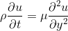
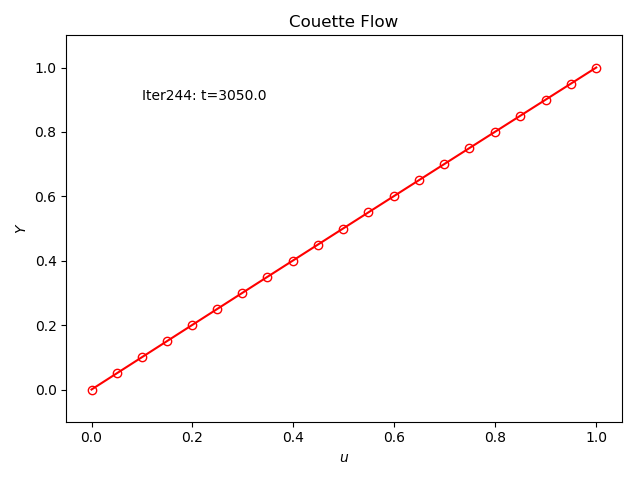
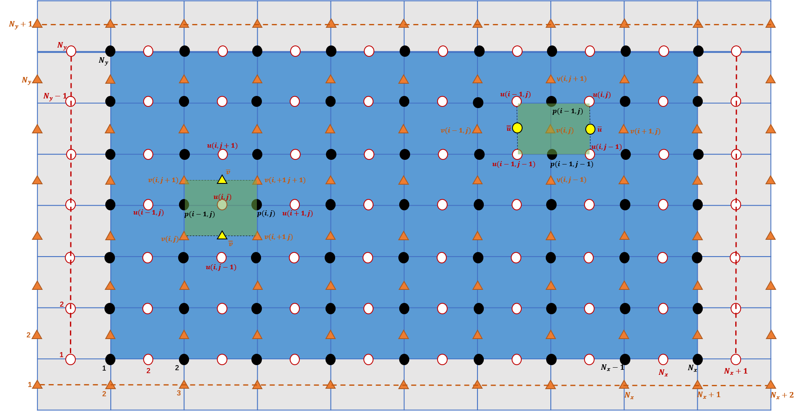
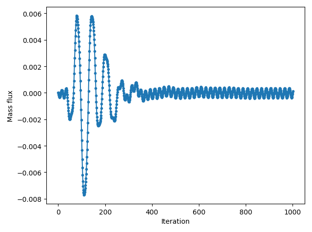
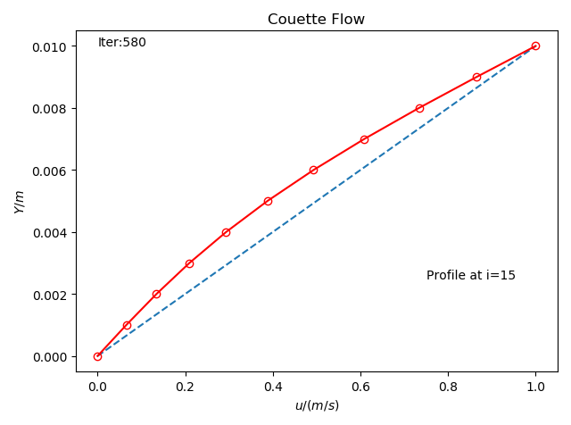

# CFD Basics
Coding practice of Anderson's CFD book: __Computational Fluid Dynamics: The basics with applications__

## Laval (Chapter7)
The Laval pipe, a classical 1D problem, based on Euler equation.
### (0) Subsonic-Supersonic Isentropic Flow
MacCormack Scheme.  
Usage:
> * Compile: `g++ main.cc -o Laval`
> * Execute: `./Laval`
> * Animate: `python3 animate.py`

The program will produce a flowfield history file named `flow.txt`, and the steady-state flowfield looks like:  

Pay attention to B.C. at both inlet and outlet!

### (1) Subsonic Isentropic Flow
MacCormack Scheme.  
Clearly, velocity peaks at central.  
Usage:
> * Compile: `g++ main.cc -o Laval`
> * Execute: `./Laval`
> * Animate: `python3 animate.py`

### (2) Conservative form for Subsonic-Supersonic Isentropic Flow
MacCormack Scheme.  
Usage:
> * Compile: `g++ main.cc -o Laval`
> * Execute: `./Laval`
> * Animate: `python3 animate.py`

### (3) Shockwave Capture
MacCormack Scheme.  
Add artificial viscosity at both prediction and correction steps.  
Usage:
> * Compile: `g++ main.cc -o Laval`
> * Execute: `./Laval`
> * Animate: `python3 animate.py`

The program will produce a flowfield history file named `flow.txt`, and the steady-state flowfield looks like:  

## Couette (Chapter8)
Viscous flow between 2 parallel plate.  
### (0) 1D simulation
The simplified G.E. is given as:  

it is similiar with unsteady heat transfer equation, which is __parabolic__.  
Crank-Nicolson method is used, which is __unconditionally__ stable due to its implicitness. Hence, larger time-step can be taken via tuning the parameter `E`.  
However, errors during iteration will get larger when `E` is increasing due to larger truncation error.  
This well illustrates that, even with implict scheme, timestep can not go to infinity!(an optimal timestep in between)

Usage:
> * Compile: `g++ main.cc -o Couette`
> * Execute: `./Couette`
> * Animate: `python3 animate.py`

The program will produce a flowfield history file named `flow.txt`, and the steady-state flowfield(with `E=1.0`) looks like:  

Be careful with the index inside the Thomas algorithm!

### (1) 2D simulation
Pressure-Correction method in general.  
Classical schemes like __SIMPLE__, __SIMPLER__, __SIMPLEC__ and __PISO__ are used on both __staggered__ and __colocated__ grids. 

#### (1.1) Staggered Grid
Grid with virtual nodes is adopted as illustrated in `Chapter 8.4.1`.  
Variable placement follows the convention introduced in `Chapter 6.8.4`.  

Standard TECPLOT ASCII data files will be produced every time-step.

##### (1.1.1) SIMPLE
Standard SIMPLE method is used to achieve final steady-state result.  
The poisson equation is solved implicitly by solving a linear system.  

Convergency history of mass flux at (15, 5):

__u__ at i=15:

Values on __Boundary__:

-|Left Inlet|Right Outlet|Top Lid|Bottom Wall
:-:|:-:|:-:|:-:|:-:
p'|zero|zero|zero-gradient|zero-gradient
u|linear extrapolation|linear extrapolation|Ue|0
v|0|by computation|0|0

Values on __virtual__ nodes are mostly calculated by __linear extrapolation__ from neighbouring nodes.  

Usage:
> * Compile: `g++ main.cc -std=c++14 -I /usr/include/eigen3 -o Couette`
> * Execute: `./Couette`
> * View full flowfield: `Tecplot` or `ParaView` or `EnSight`
> * Animate convergency history at (15, 5): `python3 animate.py`
> * Path of `Eigen3` may vary in different systems or platforms, adjust it accordingly.

##### (1.1.2) SIMPLER
It is similiar with __SIMPLE__ in general, but a better __p*__ is provided by calculating the pressure equation in advance within each iteration loop. 

Usage:
> * Compile: `g++ main.cc -std=c++14 -I /usr/include/eigen3 -o Couette`
> * Execute: `./Couette`
> * View full flowfield: `Tecplot` or `ParaView` or `EnSight`
> * Animate convergency history at (15, 5): `python3 animate.py`
> * Path of `Eigen3` may vary in different systems or platforms, adjust it accordingly.

In my practice, __SIMPLER__ is much more stable than __SIMPLE__ in terms of the divergence term.

##### (1.1.3) SIMPLEC

##### (1.1.4) PISO

#### (1.2) Colocated Grid
The colocated grids tested include __pure tetrahedron__, __pure hexahedron__ and __mixed__. All these grids are accessed under ANSYS Fluent _(*.msh)_ format.

## Plate (Chapter9)
Supersonic flow over a plate.
