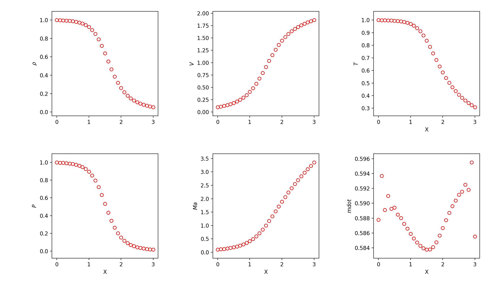
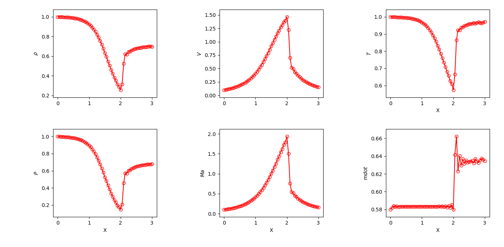
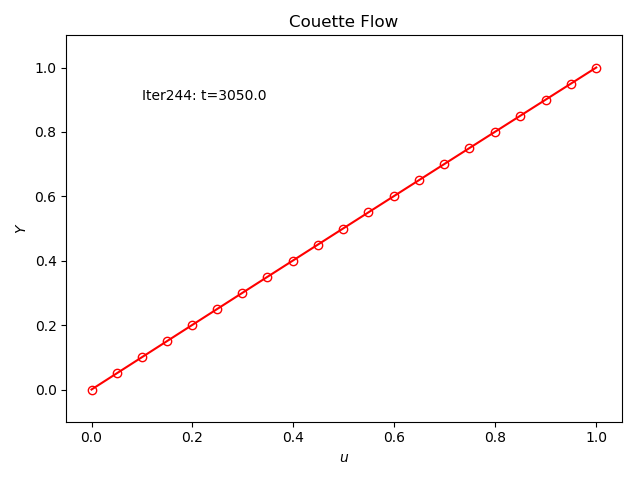

# CFD Basics
Coding practice of Anderson's CFD book: __Computational Fluid Dynamics: The basics with applications__

## Laval
The Laval pipe, a classical 1D problem, based on Euler equation.
### 0 Subsonic-Supersonic Isentropic Flow
MacCormack Scheme.  
Usage:
> * Compile: `g++ main.cc -o Laval`
> * Execute: `./Laval`
> * Animate: `python3 animate.py`

The program will produce a flowfield history file named `flow.txt`, and the steady-state flowfield looks like:  

Pay attention to B.C. at both inlet and outlet!

### 1 Subsonic Isentropic Flow
MacCormack Scheme.  
Clearly, velocity peaks at central.  
Usage:
> * Compile: `g++ main.cc -o Laval`
> * Execute: `./Laval`
> * Animate: `python3 animate.py`

### 2 Conservative form for Subsonic-Supersonic Isentropic Flow
MacCormack Scheme.  
Usage:
> * Compile: `g++ main.cc -o Laval`
> * Execute: `./Laval`
> * Animate: `python3 animate.py`

### 3 Shockwave Capture
MacCormack Scheme.  
Add artificial viscosity at both prediction and correction steps.  
Usage:
> * Compile: `g++ main.cc -o Laval`
> * Execute: `./Laval`
> * Animate: `python3 animate.py`

The program will produce a flowfield history file named `flow.txt`, and the steady-state flowfield looks like:  

## Couette
Viscous flow between 2 parallel plate.  
### 0 1D simulation
The simplified G.E. is similiar with unsteady heat transfer equation, which is __parabolic__.  
Crank-Nicolson method is used, which is __unconditionally__ stable due to its implicitness. Hence, larger timestep can be taken via tuning the parameter `E`.  
However, errors during iteration become larger when `E` is increasing due to larger truncation error.  
This well illustrates that, even with implict scheme, timestep can not go to infinity!(an optimal timestep in between)

Usage:
> * Compile: `g++ main.cc -o Couette`
> * Execute: `./Couette`
> * Animate: `python3 animate.py`

The program will produce a flowfield history file named `flow.txt`, and the steady-state flowfield(with `E=1.0`) looks like:  

Be careful with the index inside the Thomas algorithm!

### 1 2D simulation
The Pressure-Correction method is used.

## Cavity
2D Lid-driven cavity flow.
